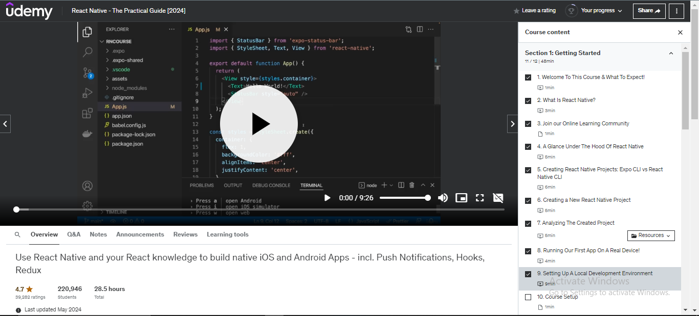

# LMS Strucctures

## 1. Firebase Products for Your LMS
Firebase Authentication: This is your foundation for managing user accounts. You'll use it to:

* Sign up/Sign in: Allow users to create accounts using email/password, Google, Facebook, etc.

* Role-based Authentication: Implement different roles (User, Instructor, Admin) and control access to features based on these roles.

* Cloud Firestore: This is your primary database for storing structured data like:

1. User Data: User profiles (name, email, bio, etc.), purchase history, course enrollments.
2. Instructor Data: Instructor profiles, course details (title, description, price, category), video links, course materials.
3. Course Data: Course content (videos, quizzes, assignments), student progress, ratings, reviews.

* Cloud Storage for Firebase: Store your course videos and other media files.

* Firebase Functions: Use these to handle server-side logic like:
1. Course Approval Workflow: Create functions to trigger email notifications to admins when instructors upload courses, and to handle admin approval/rejection.
2. Payment Processing: Integrate with payment gateways (Stripe, PayPal) to handle course purchases.
Data Validation: Ensure data integrity by validating user input before storing it in Firestore.

* Firebase Hosting: Host your LMS website and web application.

* Firebase Remote Config: Use this to dynamically update content and features without requiring app updates.

## 2. Data Structure and Properties
#### a. Users
users (Collection)

- uid (String): Unique user ID (generated by Firebase Authentication)
- email (String): User's email address
- displayName (String): User's display name
- role (String): "user", "instructor", "admin"
- profileImageURL (String): URL to user's profile picture (stored in Cloud Storage)
- coursesEnrolled (Array): List of course IDs the user is enrolled in
- purchaseHistory (Array): List of course purchase details

#### b. Instructors
instructors (Collection)
- uid (String): Instructor's user ID (linked to a user document)
- bio (String): Instructor's biography
- expertise (Array): List of instructor's areas of expertise
- courses (Array): List of course IDs created by the instructor

#### c. Courses
courses (Collection)
- courseId (String): Unique course ID
- title (String): Course title
- description (String): Course description
- category (String): Course category (e.g., "Web Development", "Data Science")
- instructorId (String): ID of the instructor who created the course
- price (Number): Course price
- status (String): "pending", "approved", "published"
- videoUrls (Array): URLs of course videos (stored in Cloud Storage)
- materials (Array): URLs of other course materials (e.g., PDFs, code samples)
- ratings (Array): Array of student ratings for the course
reviews (Array): Array of student reviews for the course

## 3. Course Approval Workflow

### Instructor Uploads Course:
- Instructor creates a new course document in the "courses" collection.
- The "status" field is set to "pending".
- Admin Review:
* A Firebase Function is triggered when a new course is created.
* The function sends an email notification to admins.
* Admins can access the course details in the Firestore database.

* Admin Approval/Rejection:
Admins can update the "status" field to "approved" or "rejected".
* If approved, the course becomes visible to users.
* If rejected, the instructor receives feedback on why the course was rejected.

## 4. Additional Considerations
- Security: Implement strong security rules in Firestore to control data access based on user roles.
- Scalability: Design your data structure to handle a large number of users, courses, and videos.
- User Interface: Create a user-friendly interface for instructors to upload courses and for users to browse and enroll in courses.
- Payment Integration:

## In your LMS:
Cloud Firestore: Store user data (profiles, enrollments), course details (title, description, instructor, status), and student progress.
Cloud Storage for Firebase: Store course videos, materials, and any user-uploaded content.

## When to Use Each
Cloud Firestore: Use for storing structured data that needs to be updated in real-time, like user profiles, course details, chat messages, and application state.
Cloud Storage for Firebase: Use for storing user-generated content like images, videos, audio files, and other media.

## Udemy player Interface

postman

### Structures

courses (collection)
  |
  |-- courseId (document)
        |-- courseTitle: string
        |-- description: string
        |-- instructorId: string
        |-- rating: number
        |-- videos (subcollection)
              |
              |-- videoId (document)
                    |-- videoTitle: string
                    |-- videoUrl: string
                    |-- order: number

